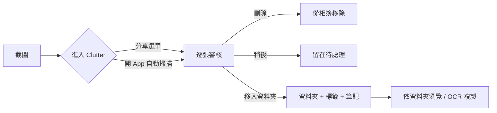

# Clutter 功能分析

2026-09-19

## App 概覽

Clutter 是一款專門處理「截圖」的整理工具，由韓國獨立開發者製作，只做一件事：把累積成山的截圖分批審核、歸入資料夾並加上標籤與筆記。

| 項目 | 內容 |
| --- | --- |
| App 名稱 | [Clutter - 截圖整理](https://apps.apple.com/tw/app/id6799858360) |
| 開發商 | hayoung jin（獨立開發者） |
| 分類 | 工具程式 |
| 評分 | 5.0 / 5（641 則評分，台灣區） |
| 價格 | 免費下載，Pro 買斷 NT$90 |
| 大小 | 55.3 MB |
| 系統需求 | iOS 15.1 以上 |
| 支援裝置 | iPhone、iPod touch（無 iPad 版） |
| 語言 | 繁體中文、簡體中文、英文、日文、韓文、法文、德文、西班牙文、越南文 |
| 隱私 | 收集購買紀錄、裝置識別碼、位置、使用資料與診斷資料，可能用於第三方廣告 |
| 最新版本 | 1.3.6 |

目標用戶是截圖量大、有「整理焦慮」的年輕用戶，例如追星、規劃活動、收集資訊時大量截圖的人。App 名稱 Clutter 本身就是「雜亂」的意思，直接點出痛點。

## 核心功能分析

Clutter 的功能集刻意精簡，只圍繞「截圖」這一種媒體類型，把「審核、歸檔、找回」做成一條直線流程。它不處理一般照片，也不做相似偵測或壓縮。

| 類別 | 功能 | 運作方式 | 解決的痛點 |
| --- | --- | --- | --- |
| 審核 | 逐張快速審核 | 從系統相簿自動抓出截圖，一張一張顯示，單一畫面內選擇「刪除、稍後處理、移入資料夾」 | 截圖堆積，不知從何下手 |
| 審核 | 分批處理 | 不要求一次清完，鼓勵「先處理幾張」；用戶回饋以 50 張為一批最順手 | 整理焦慮 |
| 歸檔 | 資料夾 | 自訂資料夾如購物、旅行、餐廳、想法；1.3.1 起可一次多張移入 | 截圖散落無分類 |
| 歸檔 | 標籤與筆記 | 每張截圖可加標籤和文字備註，之後用來搜尋 | 記不得為什麼截這張 |
| 找回 | 依資料夾瀏覽 | 按資料夾看，或逐張翻頁；長按可重新排列 | 需要時找不到 |
| 找回 | 複製截圖文字 | 直接從截圖擷取文字（OCR）複製 | 想引用截圖內文字 |
| 輸入 | 分享表單直接存入 | 截圖後在分享選單選 Clutter，不必開 App | 截圖與整理之間有斷點 |
| 輸出 | 存回相簿 | 1.3.5 起可把已歸檔截圖另存回系統相簿 | 擔心資料被鎖在 App 內 |
| 備份 | iCloud Drive 與檔案備份 | Pro 功能，1.3 起支援備份與還原 | 換機、誤刪 |
| 個人化 | 主題、首頁插圖、App 圖示 | 可自選主題與圖示，「整理也可以很可愛」 | 提高持續使用意願 |
| 隱私 | 純裝置端處理 | 截圖不上傳外部伺服器 | 截圖常含敏感內容 |

值得注意的設計取捨：

1. **歸檔即移出相簿**：截圖歸入 Clutter 後會從系統相簿處理掉，1.3.4 版特別針對「原始檔在隱藏相簿」的情況加強說明，顯示這條流程曾讓用戶困惑。
2. **不做自動分類**：與 Captr、SnapStash 等 AI 截圖 App 不同，Clutter 完全靠用戶手動判斷，換取速度與隱私。
3. **情緒化設計**：文案反覆強調「不用一次清完」，加上可愛主題，把「整理」從家事變成小遊戲。

資料來源：[App Store 台灣區頁面](https://apps.apple.com/tw/app/id6799858360)、[美國區頁面版本紀錄](https://apps.apple.com/us/app/id6799858360)。

## 使用流程與介面設計

Clutter 的主流程是「一個畫面、三個按鍵」：每張截圖出現時，用戶只需選刪除、稍後、或移入資料夾。側邊欄常駐三個資料夾快捷鍵，用戶已要求擴充到五個並支援左右手切換。

兩個入口很關鍵：截圖後直接從分享選單存入，是「隨手整理」；開 App 掃描相簿，是「集中清理」。

介面特色：

- **首頁是插畫而非照片牆**：可自選首頁插圖、主題色、App 圖示，用戶評論用「可愛」形容。
- **審核畫面不顯示剩餘張數壓力**，配合文案「先處理幾張就好」。
- **編排適應大字體**：1.3.5 版特別處理輔助使用字型放大的版面。
- **缺少復原按鍵**：台灣區評論明確要求新增 undo / redo。
- **無 iPad 版面**，只有 iPhone 直式介面。

資料來源：[App Store 台灣區評論](https://apps.apple.com/tw/app/id6799858360)。

## 商業模式與定價

Clutter 只有一個付費選項：Pro 終身版新台幣 90 元（美金 2.99），沒有訂閱。這是三款 App 中最便宜、最簡單的定價。

| 方案 | 價格 | 包含內容 |
| --- | --- | --- |
| 免費版 | 0 | 審核、資料夾、標籤、筆記、分享存入 |
| Pro 終身版 | NT$90 / US$2.99 | iCloud Drive 與檔案備份還原、排序偏好、更多主題與圖示 |

觀察：

- **免費版就能完成主要工作**，Pro 買的是安心（備份）和個性化，這種切分讓評分維持 5.0。
- **隱私標籤與文案不一致**：描述說照片不上傳，但 App Store 隱私標籤列出位置、裝置識別碼可用於第三方廣告，推測免費版有廣告 SDK。
- **上架不到一個月就有 641 則台灣評分**，屬於口碑型快速成長，低價買斷降低了付費門檻。

資料來源：[App Store 台灣區](https://apps.apple.com/tw/app/id6799858360)、[美國區](https://apps.apple.com/us/app/id6799858360)。

## 優勢與不足

Clutter 的優勢是專注與情緒設計，不足是產品還很年輕，功能與穩定度仍在快速變動。

| 優勢 | 佐證 |
| --- | --- |
| 只做截圖，定位清楚 | 評論「做到了描述的每一件事」 |
| 分批處理降低焦慮 | 評論 2,000 多張截圖以 50 張一批處理「非常方便」 |
| 標籤、筆記、OCR 讓截圖可搜尋 | 官方描述 |
| 可愛主題與圖示，高黏著度 | 評論「想用它整理人生中所有東西」 |
| 5.0 滿分，上架一個月 641 則台灣評分 | App Store 頁面 |
| 開發者幾乎每天更新 | 9 月 10 日到 9 月 18 日連發 6 個版本 |

| 不足 | 佐證 |
| --- | --- |
| 沒有 undo / redo | 台灣區評論明確要求 |
| 側邊欄只能放三個資料夾 | 評論要求擴充到五個並支援左右手 |
| 歸檔後從相簿移除，隱藏相簿情境會出錯 | 1.3.4 版本專門修復 |
| 無 iPad 版，不支援 Mac | App Store 相容性 |
| 隱私標籤與「不上傳」文案有落差 | 收集位置與裝置識別碼供廣告使用 |
| 連日更新反映穩定度尚未成熟 | 1.3.6 版本說明自己寫「抱歉頻繁更新」 |

資料來源：[App Store 台灣區評論](https://apps.apple.com/tw/app/id6799858360)、[美國區版本紀錄](https://apps.apple.com/us/app/id6799858360)。

## 對 photo-app 的啟示

Clutter 證明「只解決一個小痛點」加上好的情緒設計，可以在一個月內拿到 5.0 評分。photo-app 若想快速驗證市場，這是三款中最值得參考的產品策略。

值得借鑑：

1. **從一個媒體類型切入**：截圖在 PhotoKit 中有專屬智慧相簿，偵測成本極低，卻是用戶最有感的雜亂來源。
2. **分批處理的心理設計**：不顯示剩餘張數壓力，文案鼓勵「先處理幾張」，用戶回饋焦慮感明顯下降。
3. **分享表單入口**：截圖後直接存入，把整理嵌進產生雜亂的當下。
4. **OCR 複製文字**：iOS Vision 框架就能做，但對截圖類別的價值非常高。
5. **一次性低價買斷**：NT$90 的門檻讓用戶幾乎不猶豫，免費版已完整可用。

可以超越它的地方：

- **從第一天就有 undo / redo**：Clutter 最多用戶要求的功能。
- **支援 iPad**：Clutter 沒有，而截圖在 iPad 上也很多。
- **隱私標籤與文案一致**：不要寫「不上傳」卻在標籤列出廣告用途。
- **歸檔不移除原檔，或讓用戶選**：預設從相簿移除造成 Clutter 多次修復隱藏相簿問題。

若 photo-app 要同時處理一般照片，可以把 Clutter 的資料夾、標籤、筆記模型直接套到所有媒體，再搭配 Slidebox 式手勢，就是一個清楚的 MVP。
