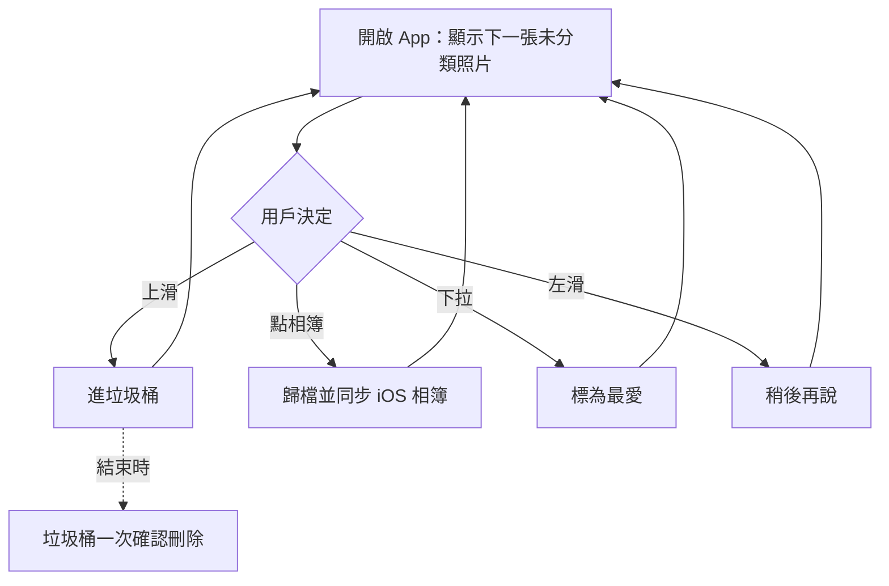

# Slidebox 功能分析

2026-09-19

## App 概覽

Slidebox 是一款以「一張一張滑動決定去留」為核心的照片清理工具，自 2015 年上架至今超過十年，定位是用最少的操作把雜亂的相簿整理乾淨。

| 項目 | 內容 |
| --- | --- |
| App 名稱 | [Slidebox: 照片清理工具](https://apps.apple.com/tw/app/id984305203) |
| 開發商 | Slidebox LLC（[官網](https://slidebox.co/)） |
| 分類 | 照片與影片 |
| 評分 | 4.8 / 5（2,821 則評分，台灣區） |
| 價格 | 免費下載，含廣告，內購訂閱或買斷 |
| 大小 | 46.5 MB |
| 系統需求 | iOS 15.0 以上 |
| 支援裝置 | iPhone、iPad、iPod touch、Mac（M1 以上）、Apple Vision Pro；另有 Android 版 |
| 語言 | 繁體中文等 15 種語言 |
| 隱私 | 收集使用資料、診斷資料與第三方廣告資料（不連結身分） |
| 最新版本 | 26.913.0 |

目標用戶是相簿累積數千張照片、想用碎片時間快速清理的一般用戶，操作門檻極低，不需要理解任何進階概念。

## 核心功能分析

Slidebox 只有五個功能，全部建立在同一個「未分類照片一張一張出現」的畫面上，每個手勢對應一個決定。它的強項不是功能多，而是每張照片只需要一個動作。

| 功能 | 手勢 / 操作 | 運作方式 | 與系統相簿的關係 |
| --- | --- | --- | --- |
| 刪除照片 | 上滑 | 先標記為「垃圾桶」，不再顯示在未分類中；稍後在垃圾桶一次確認刪除 | 確認後才進入 iOS「最近刪除」，30 天內可救回 |
| 整理進相簿 | 點一下相簿名稱 | 畫面下方列出相簿，點一下即歸檔；常用相簿可釘選到前面 | 在 iOS 相簿建立對應相簿，雙向同步 |
| 稍後決定 | 左滑 | 跳過這張，留在未分類中 | 無影響 |
| 標記最愛 | 下拉 | 再拉一次取消 | 同步到 iOS 相簿的「最愛」 |
| 比較相似照片 | 左右滑動切換 | 把相似的照片並排比較，決定留哪一張 | 刪除部分同上 |
| 復原 | 復原按鈕 | 任何動作可立即反悔 | — |
| 相簿瀏覽與移動 | 相簿頁 | 可在相簿間移動照片，一張照片可同時放入多個相簿 | 同步 |
| 雲端（限美加） | 設定內開啟 | AES-256 加密同步到 Slidebox 雲端，免費版只同步 100 張最愛，不支援影片 | 獨立於 iCloud |

兩個關鍵設計：

1. **兩階段刪除**：上滑只是「標記」，真正刪除需要到垃圾桶再按一次。這讓用戶可以快速滑動不怕誤刪，但也是用戶回報「垃圾桶刪不掉」這類 bug 的來源。
2. **完全依附系統相簿**：相簿、最愛、刪除都直接寫回 iOS 相簿，App 本身不存實體資料。好處是刪了 App 也不會損失成果，壞處是隱藏相簿、iCloud 同步狀態會造成「整理過的照片又跳回未分類」。

資料來源：[App Store 台灣區](https://apps.apple.com/tw/app/id984305203)、[美國區頁面](https://apps.apple.com/us/app/slidebox-photo-cleaner-app/id984305203)、[官方 iOS FAQ](https://slidebox.co/faq-ios.html)。

## 使用流程與介面設計

Slidebox 的介面只有一個主畫面：中間一張大照片，下方一排相簿按鈕。用戶不需要選擇「要做什麼」，App 直接把下一張未分類照片送到面前。

每一張照片都回到同一個迴圈，直到未分類清空。這是典型的「Tinder 式」流程。

介面特色：

- **一張一決定**：用戶評論形容「逼迫自己去整理照片」，因為不處理就看不到下一張。
- **可釘選常用相簿**，減少選相簿時的猶動。
- **前後對比進度**：美國區評論提到兩天內從 21,000 張整理到 6,000 張，快速回饋是黃金點。
- **沒有教學引導**：多則評論提到事後才發現「一鍵取消所有最愛」、「已標最愛的照片不能上滑刪除」這類進階規則。
- **廣告插入流程**：免費版在滑動之間插入廣告，台灣區評論抱怨廣告會中斷正在播放的音樂。

資料來源：[官網](https://slidebox.co/)、[美國區頁面評論](https://apps.apple.com/us/app/slidebox-photo-cleaner-app/id984305203)。

## 商業模式與定價

Slidebox 採「免費 + 廣告 + 訂閱或買斷」，免費版功能完整但有廣告，付費主要買的是去廣告與雲端。價格年年上漲，是負評的主要來源。

| 方案 | 台灣區（新台幣） | 美國區（美元） |
| --- | --- | --- |
| 週訂閱 | 60 / 90 | 1.99 / 2.99 |
| 月訂閱 | — | 4.99 |
| 年訂閱 | 690 / 990 | 19.99 / 29.99 / 49.99 |
| 終身買斷 | 990 / 1,490 | 29.99 / 49.99 |

觀察：

- **同一方案帶多個價位**，代表異地、異時的定價實驗；2021 年美國區評論提到終身版只要美金 8 到 10 元，現在漲到 29.99 到 49.99。
- **免費功能逐年縮水**：網路評論普遍抱怨原本免費的功能被收回、廣告不能跳過。
- **雲端服務只限美加**，對台灣用戶而言付費價值就只剩去廣告。
- **週訂閱**是針對「一次性大清理」的短期需求設計，這類工具用戶常常清完就不再開。

資料來源：[App Store 台灣區](https://apps.apple.com/tw/app/id984305203)、[美國區](https://apps.apple.com/us/app/slidebox-photo-cleaner-app/id984305203)、[官方 FAQ](https://slidebox.co/faq-ios.html)。

## 優勢與不足

Slidebox 的優勢是極低的操作門檻和十年累積的口碑，不足集中在商業化引發的體驗退化。

| 優勢 | 佐證 |
| --- | --- |
| 一張一手勢，完全不用學 | 評論「非常基礎但恰好就是我要的」 |
| 大量照片可在幾天內清完 | 評論兩天從 5,000 張清到 1,996 張；9 小時從 21,000 張到 6,000 張 |
| 全部寫回 iOS 相簿，無鎖定風險 | 官方 FAQ 明訂相簿、最愛雙向同步 |
| 兩階段刪除 + 30 天可救回 | 減少誤刪恐懼 |
| 15 種語言，含繁體中文，另有 Android 版 | App Store 頁面 |

| 不足 | 佐證 |
| --- | --- |
| 廣告頻繁且中斷音樂 | 台灣區評論直接抱怨 |
| 已整理的照片無法重新整理 | 台灣區評論要求新增「標記已整理」與時間軸 |
| 隱藏相簿照片反覆跳回未分類 | 台灣區評論回報 |
| 垃圾桶刪不掉、購買流程 bug | 網路評論彙整；26.913.0 版本說明「修復購買錯誤」 |
| 免費功能逐年收回、定價上漲 | 終身版從美金 8 元漲到 49.99 |
| 批次刪除麻煩 | 美國區評論「大量刪除我還是用內建相簿」 |
| 無教學，進階功能靠自己摸索 | 評論事後才發現一鍵取消最愛 |

資料來源：[App Store 台灣區評論](https://apps.apple.com/tw/app/id984305203)、[美國區評論](https://apps.apple.com/us/app/slidebox-photo-cleaner-app/id984305203)、[官方 FAQ](https://slidebox.co/faq-ios.html)。

## 對 photo-app 的啟示

Slidebox 是這個品類的原型，它的上滑刪除、下拉最愛、點相簿歸檔已經是用戶預期的預設行為。photo-app 若做清理功能，應直接沿用這套手勢，把力氣花在 Slidebox 做不好的地方。

值得借鑑：

1. **單一主畫面、一張一決定**：這是用戶願意花 9 小時滑 21,000 張的原因。
2. **所有結果寫回系統相簿**：相簿、最愛、刪除都用 PhotoKit 同步，App 不存實體資料，用戶不怕被鎖定。
3. **兩階段刪除 + 立即復原**：降低快速滑動時的誤刪恐懼。
4. **常用相簿釘選**：小功能，但對高頻歸檔很重要。

可以超越它的地方：

- **已整理與未整理的狀態要可見、可回頭**：台灣用戶抱怨整理過就不能再整理，這是明確的缺口。
- **正確處理隱藏相簿與 iCloud 同步狀態**：否則照片會反覆跳回未分類，Slidebox 和 Clutter 都在這裡摔過。
- **批次刪除**：逐張滑適合判斷，但連拍、重複這類明確垃圾需要一鍵多選。
- **免費版不插廣告或只插非中斷式廣告**：廣告中斷音樂是 Slidebox 評分下滑的主因。
- **前 30 秒的教學**：一張手勢圖就能解決多則評論提到的「事後才發現」。
