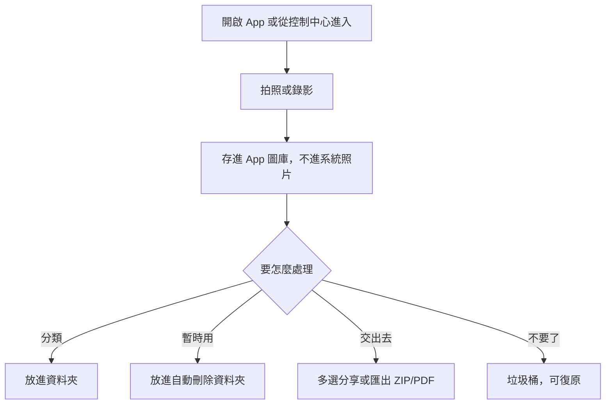

# Sub Camera 功能分析

2026-09-21

## App 概覽

Sub Camera 不是照片清理工具，而是一支「副相機」：拍的照片與影片存在 App 自己的空間，不進入 iOS 的「照片」App。定位是把工作、紀錄、暫時用的照片，跟個人相簿分開。它跟 photo-app 不是直接競爭，而是從另一個方向解決「相簿太亂」：與其事後整理，不如一開始就不放進去。

| 項目 | 內容 |
| --- | --- |
| App 名稱 | [Sub Camera](https://apps.apple.com/tw/app/sub-camera/id6770336562)（副標：Essential Camera for Work） |
| 開發商 | DAIN JUN |
| 分類 | 照片與影片 |
| 評分 | 台灣區 5.0 / 5（4 則評分）；美國區 5.0 / 5（1 則評分） |
| 價格 | 免費下載，內購一項：Sub Camera+ 買斷 |
| 大小 | 6.5 MB |
| 系統需求 | iOS 18.0 以上 |
| 支援裝置 | iPhone、Mac（M1 以上）、Apple Vision Pro（visionOS 2.0 以上） |
| 語言 | 繁體中文、簡體中文、英文、德文、日文、韓文、波蘭文、土耳其文 |
| 年齡分級 | 4+ |
| 隱私 | 收集裝置識別碼、使用資料、診斷資料，不連結身分，用於第三方廣告與分析 |
| 最新版本 | 2.0（頁面顯示「3 天前」更新，約 2026-09-18） |
| 首次上架 | 版本紀錄 1.0 是 5 月 20 日（頁面沒有標年份，從 App ID 與版本編號推測是 2026 年） |

評分數量極少，代表 App 很新、用戶量還很小，評分本身不能拿來推論口碑。

## 核心功能分析

| 功能 | 運作方式 | 免費／付費 |
| --- | --- | --- |
| 獨立拍照與錄影 | 用 App 內的相機拍，不寫入系統照片；1.3.0 加入錄影與橫向模式 | 免費 |
| App 內圖庫 | 拍下的照片與影片存在 App 裡，支援雙指縮放（1.1.2） | 免費 |
| 資料夾整理 | 用資料夾分類，例如依專案或日期 | 免費 |
| 自動刪除資料夾 | 暫時用的照片放進去，過一段時間自動刪除 | 免費（從頁面描述判斷，版本紀錄未寫規則） |
| 多選分享、批次刪除 | 多選後一次分享或刪除；用戶評論稱讚批次刪除與流暢的流程 | 免費 |
| 垃圾桶復原 | 刪除先進垃圾桶，永久刪除前可以救回 | 免費 |
| 匯出 | 多檔匯出成 ZIP、PDF 匯出（1.1.2 加快） | 免費 |
| 裁切與旋轉 | 1.2.0 加入 | 免費 |
| 水平儀 | 1.3.0 改善 | 免費 |
| 時間戳與位置戳 | 把拍攝時間、地點印在照片上 | **Sub Camera+** |
| 照片標註 | 在照片上畫圖、寫字 | **Sub Camera+** |
| iOS 捷徑、控制中心 | 從控制中心或捷徑直接開相機 | 免費 |

兩個關鍵設計：

1. **資料留在 App 裡，不進系統相簿**：這是它存在的理由，也是最大的限制。刪掉 App 資料就不見，也不能在「照片」App 裡看。
2. **暫存概念**：自動刪除資料夾把「這批照片只是暫時要用」變成一個明確的類別，使用者不需要事後再想「要不要刪」。

資料來源：[App Store 台灣區](https://apps.apple.com/tw/app/sub-camera/id6770336562)、[美國區頁面](https://apps.apple.com/us/app/sub-camera/id6770336562)（版本紀錄與英文描述）。

## 使用流程與介面設計

App 的描述強調「原生 iOS 體驗、清楚的系統控制項、簡潔的字體和安靜的介面」，走的是跟系統相機一樣的低干擾路線。

介面觀察（限於商店頁面資訊，我沒有實際安裝使用）：

- **入口很短**：控制中心與捷徑讓「想拍就拍」跟系統相機一樣快，這是這類 App 能不能被日常使用的關鍵。
- **免費就有核心功能**：拍、存、資料夾、匯出都免費，付費只買「加工」（時間戳、標註）。
- **多語系到位**：8 種語言，包含繁體中文，對一個新 App 算完整。

## 商業模式與定價

只有一個內購：**Sub Camera+ 買斷**，沒有訂閱。

| 方案 | 台灣區 | 美國區 |
| --- | --- | --- |
| Sub Camera+ 買斷 | 390（頁面顯示 $390.00，推定為新台幣） | US$11.99 |

觀察：

- **買斷、不訂閱**：付費內容是「一次性工具」（印時間戳、標註），沒有持續的雲端或內容成本，買斷合理。
- **免費版功能完整**：免費用戶不會被卡在核心流程，付費是加值，轉換壓力低。
- **價格偏低**：約是 Slidebox 買斷價（台灣 990 到 1,490）的三分之一以下，也遠低於 photo-app 目前設想的買斷價。
- **隱私標示含第三方廣告**：免費版可能有廣告，頁面沒有寫廣告形式，我沒法確認。

資料來源：[App Store 台灣區](https://apps.apple.com/tw/app/sub-camera/id6770336562)、[美國區](https://apps.apple.com/us/app/sub-camera/id6770336562)。

## 優勢與不足

| 優勢 | 佐證 |
| --- | --- |
| 解決明確的場景：工作照與個人照分開 | App 描述，並有類似 App（WorkCam、SecondPhoto、Clips）出現，代表需求真實存在 |
| 免費就能完成主要工作 | 付費只有時間戳與標註 |
| 更新很勤 | 2 個月內從 1.0 到 2.0，含錄影、裁切、匯出 |
| 檔案小、支援 Mac 與 Vision Pro | 6.5 MB、多平台 |
| 批次刪除受好評 | 台灣區評論摘要 |

| 不足 | 佐證 |
| --- | --- |
| 資料只在 App 裡，換手機或刪 App 會遺失 | 描述強調「不進系統相簿」，沒有提到雲端備份 |
| 用戶與評論極少，口碑無法驗證 | 台灣區 4 則、美國區 1 則評分，沒有可讀的評論內文 |
| 只做「拍」這一段，沒有整理既有相簿的能力 | 功能清單沒有匯入系統照片或整理舊照片 |
| 限 iOS 18 以上 | 排除舊裝置用戶 |
| 廣告與第三方分析資料收集 | 隱私標示 |

資料來源：[App Store 台灣區](https://apps.apple.com/tw/app/sub-camera/id6770336562)、[美國區](https://apps.apple.com/us/app/sub-camera/id6770336562)。同類 App：[WorkCam](https://apps.apple.com/us/app/workcam/id1579375801)、[SecondPhoto](https://apps.apple.com/us/app/secondphoto-camera-album/id6774628006)。

## 對 photo-app 的啟示

Sub Camera 跟 photo-app 面對同一個問題（相簿太亂），但解法相反：Sub Camera 從源頭分流，photo-app 事後整理。兩者其實互補，用戶不太會二選一。

值得借鑑：

1. **「暫時」是一種獨立的類別**：自動刪除資料夾讓用戶明說「這批是暫時的」。photo-app 可以考慮讓標籤或相簿設「保留 30 天後提醒刪除」，把整理的決定提前。
2. **付費只賣加工，不賣核心流程**：免費版做完主要工作，付費買時間戳、標註這類加值。photo-app 目前用「每天 30 張」限制核心流程，這點跟它相反，值得評估。
3. **買斷價偏低仍可行**：這類單機工具用 390 元買斷已有人做，photo-app 的買斷價需要跟它對照。
4. **控制中心與捷徑入口**：降低開啟成本。photo-app 已有桌面小工具，控制中心與捷徑是還沒做的入口。
5. **批次刪除受好評**：印證前一輪分析（Slidebox、Clutter）的共同結論：批次操作是這類 App 的基本要求。

可以做得不一樣的地方：

- **不把資料鎖在 App 裡**：photo-app 整理的結果寫回系統相簿，用戶換手機不怕遺失，這是相對於 Sub Camera 的明確優勢。
- **服務「已經存在」的大量照片**：Sub Camera 只管新拍的，photo-app 可以處理累積多年的舊相簿。
- **反過來的功能**：Sub Camera 的用戶會累積大量 App 內照片，最後仍需要整理，這是 photo-app 的潛在用戶，但需要支援匯入或資料夾整理，目前沒有計畫。

## 限制說明

- 這份分析只依據 App Store 頁面與版本紀錄，**我沒有安裝、也沒有實際操作**，介面與流程是從功能描述推論，不是親眼看到。
- 評論內文沒有取得（頁面只有評分，沒有可讀的評論），「批次刪除受好評」是頁面摘要的一句話，證據薄弱。
- 台灣區價格顯示為「$390.00」，沒有貨幣符號，推定為新台幣。
- 首次上架年份是推測。
