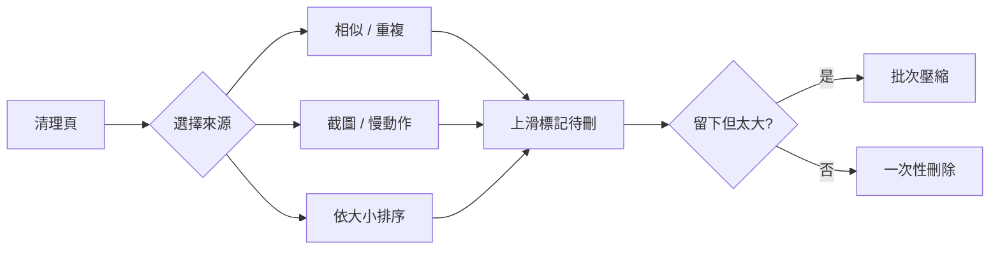

# 相冊助手 功能分析

2026-09-19

## App 概覽

相冊助手是一款由獨立開發者打造的「全能型」相簿管理工具，定位是取代 iOS 內建相簿的整理、清理與地圖瀏覽功能，主要面向中國大陸 iPhone 用戶。

| 項目 | 內容 |
| --- | --- |
| App 名稱 | [相冊助手 - 全能相冊管理專家](https://apps.apple.com/cn/app/id1661734997) |
| 開發商 | Beijing Yunli Network Technology Co., Ltd（獨立開發者 Simon） |
| 分類 | 攝影與錄影 |
| 評分 | 4.8 / 5（5,499 則評分，中國區） |
| 價格 | 免費下載，內購解鎖 VIP |
| 大小 | 68.4 MB |
| 系統需求 | iOS 16.6 以上 |
| 支援裝置 | iPhone、iPad、Mac（M1 以上）、Apple Vision Pro |
| 語言 | 簡體中文、英文 |
| 隱私 | 開發者聲明不收集任何資料 |
| 最新版本 | 2026.0828 |

目標用戶是照片量大（數萬張）、希望在手機上一次完成清理、壓縮、分類與旅程回顧的攝影愛好者，而非只想快速刪照片的輕度用戶。

## 核心功能分析

相冊助手把自己定義為「相簿管理 + 壓縮」App，官方列出 12 項功能，可歸納為「找、刪、瘦身、整理、回顧」五大類。功能廣度遠超同類 App，但也因此學習成本最高。

| 類別 | 功能 | 運作方式 | 解決的痛點 |
| --- | --- | --- | --- |
| 找 | 日曆化檢索 | 以年曆、月曆、日曆三種視圖展示照片，切換有動畫 | 照片太多找不到 |
| 找 | 分類排序 | 依大小、時長、碼率、解析度排序；自動列出截圖、慢動作、延時 | 想找特定類型檔案 |
| 找 | 相似與重複偵測 | 演算法列出相似、重複檔案，2026.08 兩次改版強化準確度 | 連拍、重複儲存 |
| 刪 | 上滑刪除 | 上滑手勢先「標記待刪」，最後一次性刪除 | 逐張刪除效率低 |
| 瘦身 | 批次壓縮 | 可設定壓縮率、影片碼率、解析度、FPS | 不重要檔案佔空間 |
| 瘦身 | 每日統計 | 按年、月、日統計相簿佔用空間 | 不知道空間去哪了 |
| 整理 | 相簿管理 | 按旅行、工作、家庭分類；旅行相簿自動產生旅行日誌、天數、途經城市、行程地圖 | 手動建相簿麻煩 |
| 整理 | 批次旋轉與裁切 | 多張一起旋轉，或裁成相同比例、尺寸 | 方向錯誤的照片 |
| 整理 | 批次調色與濾鏡 | 可視化參數調整，調色方案可存成自訂濾鏡重複套用 | 一批照片風格不一致 |
| 整理 | 日記與備註 | 相簿層級寫日記，單檔加備註 | 記錄旅行、工作脈絡 |
| 回顧 | 行程地圖 | 地圖上呈現數萬檔案，自動產生每日行程軌跡 | 想看去過哪裡 |
| 回顧 | 一鍵幻燈 | 自動連播照片與影片，依日記與備註產生字幕，可選背景音樂與濾鏡 | 旅行後做影片麻煩 |
| 基礎 | iCloud 相簿支援 | 直接操作系統相簿，開啟 iCloud 照片即自動同步 | 不需另建雲端 |

三個最具差異化的功能：

1. **旅行相簿自動化**：把相簿升級為「旅程」物件，自動掛上天數、城市、軌跡地圖，這是內建相簿與其他清理 App 都沒有的。
2. **批次壓縮可調參數**：多數清理 App 只能刪，相冊助手提供「留下但變小」的中間選項，對捨不得刪的用戶很有吸引力。
3. **調色方案可存為自訂濾鏡**：把編修功能也納入批次流程，減少用戶在多個 App 之間切換。

資料來源：[App Store 中國區頁面](https://apps.apple.com/cn/app/id1661734997)，2026.0828 版本說明。

## 使用流程與介面設計

相冊助手的介面是「多入口工具箱」：底部分頁包含日曆、相簿、地圖（可關閉）、清理等入口，每個入口對應一組批次工具，用戶需要先知道自己要做什麼。

典型的清理路徑：

清理頁先讓用戶選一個候選清單（相似、截圖、大檔），再逐張上滑標記，最後選擇壓縮或刪除。

典型的旅行整理路徑：

1. 在日曆視圖找到旅行日期範圍。
2. 建立「旅行」類型相簿，把照片拉進去。
3. App 自動產生旅行日誌、天數、城市、行程地圖，照片依日排成九宮格。
4. 寫日記或備註，按一鍵幻燈輸出帶字幕與音樂的影片。

介面特色與問題：

- **年曆、月曆、日曆三層縮放**，切換有動畫，是用戶評論中最常被稱讚的部分。
- **影片播放器有預覽卷軸**，比 iOS 18 內建相簿只有進度條更好用。
- **雙擊動作可自訂**，2026.0823 版新增 100% 比例檢視。
- **介面曾大改又改回**：2026.0823 版本說明寫到「恢復之前的 UI 設計，讓介面更簡單」，反映功能過多導致的導航壓力。
- **只有簡體中文與英文**，台灣用戶會看到簡體介面。

資料來源：[App Store 版本紀錄](https://apps.apple.com/cn/app/id1661734997)、[土叔分享評測](https://www.tushushare.com/categories/software/ios-album-assistant/)。

## 商業模式與定價

相冊助手採「免費下載 + 多層次 VIP」，同時提供訂閱、單次買斷與分模組解鎖，選項多達 10 種，是三款 App 中最複雜的定價。沒有廣告。

| 方案 | 價格（人民幣） | 類型 |
| --- | --- | --- |
| 月度 VIP | ¥6 | 單次 |
| 自動包月 VIP | ¥28 | 訂閱 |
| 年度 VIP | ¥38 | 單次 |
| 單年 VIP | ¥48 | 單次 |
| 自動包年 VIP | ¥68 | 訂閱 |
| 永久 VIP | ¥58 / ¥198 | 買斷（兩個價位並存） |
| 永久 VIP 特惠 | ¥128 | 買斷 |
| 清理文件和整理相簿永久解鎖 | ¥28 | 單模組買斷 |
| 分類排序和空間統計永久解鎖 | ¥12 | 單模組買斷 |

觀察：

- **分模組買斷**是少見的設計，只想清照片的用戶花 ¥28 就能解鎖，不必為地圖、調色付費。
- **同一名稱多個價位**（永久 VIP ¥58 與 ¥198）反映開發者常做限時促銷或 A/B 測試。
- **個人開發者直接在評論區回覆**，並以微信提供技術支援，這是中國區獨立 App 常見的用戶經營方式。

資料來源：[App Store 中國區內購項目](https://apps.apple.com/cn/app/id1661734997)。

## 優勢與不足

相冊助手的優勢是功能廣度與隱私，不足是複雜度與局限於中國區。

| 優勢 | 佐證 |
| --- | --- |
| 一款 App 涵蓋清理、壓縮、編修、地圖、幻燈 | 用戶評論「完全可以替代其他輔助相冊軟件了」 |
| 自動偵測截圖、慢動作、大檔 | 用戶評論「解決很多痛點」，特別稱讚截圖批次清理 |
| 不收集任何資料，無自建伺服器 | App Store 隱私標籤與官方描述一致 |
| 開發者回應快，依評論加功能 | 用戶要求複製座標，下個版本就加上 |
| 不靠廣告，定價入門低 | 月度 VIP ¥6，單模組 ¥12 起 |

| 不足 | 佐證 |
| --- | --- |
| 相似照片偵測準確度不足 | 用戶評論「希望改進下相似照片」，開發者承認演算法優先速度 |
| 功能過多導致 UI 反覆 | 2026.0823 版本把新 UI 改回舊版 |
| 只有簡體中文與英文，只上架中國區 | 台灣用戶需切換 Apple ID 地區才能下載 |
| 定價選項多到讓人迷惑 | 同名方案多個價位，10 種內購 |
| iOS 16.6 以上才能用 | 比另兩款門檻高 |
| 偷發性當機 | 2026.0724 版修復待刪功能卡死 |

資料來源：[App Store 中國區評論與版本紀錄](https://apps.apple.com/cn/app/id1661734997)。

## 對 photo-app 的啟示

相冊助手證明「全功能」路線在中國區可行，但也證明功能越多介面越難收斂。photo-app 目前尚未開始開發，建議只借其中三項，並避開它的複雜度。

值得借鑑：

1. **「先標記、最後一次刪」的上滑模式**：三款 App 都採用，已是這個品類的標準手勢，不必重新發明。
2. **自動分群的候選清單**：截圖、連拍、大檔、慢動作各自成一個入口，用戶評論中這是最常被稱讚的功能。
3. **「壓縮」作為刪除以外的第二選項**：Slidebox 與 Clutter 都沒有，可以是差異化點，但實作成本高（需處理影片轉碼），可放第二階段。

應避開：

- **不要一次做 12 項功能**：相冊助手花了三年，且 UI 已經改了又改回。
- **不要定價選項超過三個**：10 種內購讓用戶無法決定。
- **不要只做單一語言**：台灣市場繁體中文是基本門檻。

技術面它展示的能力需求：PhotoKit 直接存取系統相簿、本地相似度演算法（開發者自認準確度與速度難兩全）、以及完全不經過伺服器的隱私架構。
