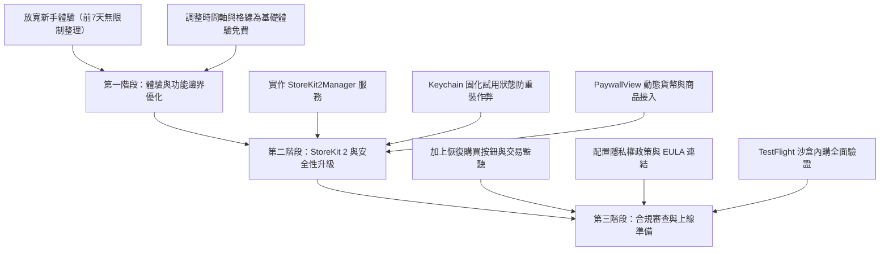

# PicDeck 上架前商業化與計費方案調整建議書

- **文件版本**：v1.0
- **撰寫日期**：2026-09-25
- **目標範圍**：免費方案體驗優化、付費轉換策略、App Store 合規性、StoreKit 2 架構升級與防破解安全設計。

---

## 1. 執行摘要（Executive Summary）

PicDeck 目前在本地端已建立了相當完整的免費（Free Tier）與付費（Pro）功能切割模型（包含整理照片限額、標籤上限、日記限額與 Paywall 彈窗展示）。

然而，目前架構主要基於本地 `UserDefaults` 與模擬購買邏輯。在邁向 App Store 正式上架與商業化之前，需針對 **「轉換率優化（心理學）」**、**「StoreKit 2 原生金流」**、**「App Store 審查合規（Guideline 3.1）」** 與 **「防偽／防重裝重置」** 進行系統性升級。

---

## 2. 現行方案檢視與潛在問題診斷

### 2.1 現有設計分析
| 模組 | 現行實作 | 現有優勢 | 潛在問題 |
| :--- | :--- | :--- | :--- |
| **解鎖狀態管理** | `AppModel.isUnlocked`（`UserDefaults`） | 邏輯集中、易於本地測試與預覽 | 易被越獄、工具或重裝修改繞過 |
| **整理功能限制** | 每日限整理 20 張（`dailyReviewLimit = 20`） | 形成明確的升級動機 | 新用戶體驗門檻過高，可能過早流失 |
| **時間軸功能** | 非 Pro 點擊時間軸會彈出 Paywall 攔截 | 強制引導付費 | 基礎瀏覽體驗受損，易招致 1 星差評 |
| **金流整合** | 本地假購買（Mock Purchase） | 開發期免配置憑證即可測試 UI | 無法在 App Store 扣款，缺少續訂監聽 |
| **審查要件** | 缺少恢復購買與 EULA 連結 | 介面簡潔 | **100% 會被 Apple 審查退件（Guideline 3.1.1）** |

---

## 3. 免費方案（Free Tier）調整策略：提升「留存」與「付費意願」

### 3.1 「新手體驗鉤子」策略（Onboarding Hook）
相簿整理工具的關鍵在於**「讓使用者第一次就爽快地刪掉幾百張照片」**。如果新用戶剛下載滑了 20 張就被擋住，通常不會付費，而是直接刪除 App。

- **建議調整**：
  1. **首週新手光環（First 7 Days Full Access）**：
     - 新安裝的前 7 天，整理張數無上限，日記無上限。
     - 讓用戶在相簿整理到一半時建立心理投入（Sunk Cost）與工具依賴。
  2. **常態免費額度（Daily Allowance）**：
     - 新手期結束後，每日提供 **30 張** 免費整理額度（比 20 張稍寬鬆，足夠應付日常新照片，但想整理陳年舊照必須升級 Pro）。
     - 提供「看激勵廣告解鎖額度（可選）」或「單日連續簽到領取額外張數」。

### 3.2 基礎瀏覽全免費，進階客製列入 Pro
照片 App 的基本使命是「看照片」。建議：
- **全面免費開放**：
  - 年、月、全部、時間軸的**基礎瀏覽**全面開放。
- **保留為 Pro 核心賣點**：
  - **無限照片整理**（Swipe to Cleanse）。
  - **自訂日／月／年封面**（Photo Covers）。
  - **原比例／方形格線即時切換**。
  - **自訂 App 主題色、深色模式與自訂圖示**。
  - **桌面小工具所有進階樣式**。
  - **無限標籤分類與專屬自訂標籤顏色／圖示**。

---

## 4. 定價矩陣與商業模式建議

相片整理與生活記錄類工具，在 App Store 表現最佳的價格組合為「**自動續訂（訂閱制） + 買斷制（Lifetime）**」並行：

| 方案 | 建議定價（TWD / USD） | 適用受眾 | 促銷策略 |
| :--- | :--- | :--- | :--- |
| **月訂閱 (Monthly)** | NT$ 90 / $2.99 | 臨時需要大整理一兩次的照片整理者 | 無試用期 |
| **年訂閱 (Yearly)** | NT$ 490 / $15.99 | 長期記錄生活、育兒、高頻拍照者 | **提供 3 天或 7 天免費試用**（轉換率主力） |
| **終身買斷 (Lifetime)** | NT$ 1,290 / $39.99 | 討厭訂閱制的重度支持者、極客用戶 | 早鳥特惠或黑五促銷可折至 NT$ 990 |

> **定價心理學**：年費 NT$ 490 折合每月僅約 NT$ 40，對比月費 NT$ 90 具有強烈性價比；終身買斷為年費的 2.6 倍，既能保護長期訂閱價值，又能捕獲高客單價用戶。

---

## 5. 技術架構升級路徑（上架前必備）

### 5.1 導入 Apple 原生 StoreKit 2
淘汰舊有 StoreKit 1 與本地假狀態，改採現代 Swift Concurrency 的 StoreKit 2：

1. **商品資訊動態拉取**：
   ```swift
   let products = try await Product.products(for: ["com.picdeck.pro.monthly", "com.picdeck.pro.yearly", "com.picdeck.pro.lifetime"])
   ```
   確保各國幣別（TWD, USD, EUR, JPY 等）與在地化價格由 Apple 伺服器動態填入。

2. **全局交易監聽（Transaction.updates）**：
   在 App 啟動時即註冊背景監聽：
   ```swift
   for await verificationResult in Transaction.updates {
       // 處理自動續訂、退款、家庭共享等交易變更
   }
   ```
   使用者若在 iOS 系統設定中退訂或退款，App 本地能即時取消 Pro 資格，合規且準確。

3. **恢復購買（Restore Purchases）**：
   在 `PaywallView` 頂部或底部常駐「恢復購買」按鈕：
   ```swift
   try await AppStore.sync()
   ```

### 5.2 安全性防護：防禦重裝與時間修改作弊
- **現行漏洞**：若僅存於 `UserDefaults`，刪除 App 重裝即可無限洗「7 天免費試用」。
- **防禦手段**：
  - **Keychain 綁定**：將設備初次安裝時間戳 `firstInstallDate` 與試用開始日存於 **Keychain**。即便使用者移除 App，Keychain 數據仍會被 iOS 系統保留，重新安裝時能辨識出非全新設備。
  - **iCloud Key-Value Store（可選）**：同步跨裝置試用狀態，防止同一 Apple ID 換設備白嫖試用。

---

## 6. App Store 審查合規清單（App Store Review Guidelines）

在正式打包上傳 App Store Connect 審查前，必須逐項確認以下合規檢查點：

- [ ] **Guideline 3.1.1 - 恢復購買**：Paywall 畫面必須有明確可見的「恢復購買（Restore）」按鈕。
- [ ] **Guideline 3.1.2 - 訂閱說明規範**：
  - 明確顯示訂閱週期（每週/每月/每年）與價格。
  - 明確提示「費用將於確認購買時自 Apple ID 帳戶扣除」。
  - 明確說明「續訂前 24 小時內會自動扣款，使用者可於 Apple ID 設定隨時取消」。
- [ ] **法律條款連結**：
  - 放置點擊可開啟 Safari 的 **隱私權政策（Privacy Policy）** 連結。
  - 放置點擊可開啟 Safari 的 **使用者使用條款（EULA / Terms of Use）**（可採用 Apple 標準 EULA）。
- [ ] **家庭共享（Family Sharing）配置**：若開放家庭共享，需於 App Store Connect 勾選並於 StoreKit 設定中確認權限同步。

---

## 7. 階段性實施路線圖（Roadmap）



---

## 8. 結論

PicDeck 具備優秀的互動流暢度與相片管理價值。目前的計費邏輯架構已具備雛形，無須推翻重來。只要在正式商業化前，**依照本建議書將商品金流切換至 StoreKit 2、落實 Keychain 狀態保護，並補齊 Apple 審查要求的條款與恢復功能**，即可平穩上架並實現健康的營收轉換。
