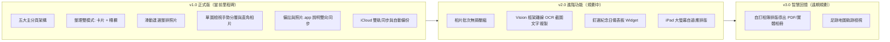

# PicDeck 產品企劃書（Product Planning Specification）

> **版本**：2.0.0（2026-09-25 重大更新）  
> **狀態**：正式生效，與實作代碼及操作規範手冊 100% 同步  
> **定位**：iPhone 整合式相簿整理與圖文回憶生活 App  

---

## 零、產品核心概念與願景

### 1. 一句話定位
**「用 Slidebox 的手勢極速整理，配 Daylio 的圖文生活回憶，加上與系統照片庫深度融合的零焦慮體驗。」**

### 2. 解決痛點
傳統相簿管理與整理工具存在三大斷層：
1. **清理工具功能單一**（如 Slidebox）：手勢順手但無法做細緻分類，廣告頻繁且轉向高昂訂閱制；
2. **深度整理過於繁複**（如相冊助手）：功能堆砌、層級混亂、10 種內購讓人無所適從；
3. **照片整理與生活紀錄割裂**：整理完照片後，珍貴的紀念日、日常感想與隨手筆記無處安放，無法轉化為有溫度的回憶。

**PicDeck 的解方**：
- 將「日常圖文日記」與「高效率相簿整理」深度整合於五大分頁體系；
- 徹底捨棄複雜的自建演算法與外包伺服器，**100% 依託 iOS 原生 PhotoKit 與本機沙盒**；
- 兼顧「單張沉浸卡片手勢」與「批次網格連選（柵欄模式）」，並實現備註與系統「照片.app」說明的**即時雙向同步**。

---

## 一、已確認產品決策（Product Decisions）

| 決策項目 | 拍板內容 | 備註說明 |
| :--- | :--- | :--- |
| **App 名稱** | **PicDeck（中文名：相牌）** | App Store 經查無撞名。Deck 寓意如卡牌般流暢滑動整理。 |
| **支援平台** | **iOS 17.0+**（iPhone 優先適配） | 針對 iPhone 直式螢幕深度最佳化，未來預留 iPad 版面。 |
| **語言支援** | **繁體中文 + 英文** | 全面走 `Localizable.xcstrings` 國際化架構。 |
| **外觀模式** | **淺色（Light）／深色（Dark）／跟隨系統** | 根層級統一控制；單圖與全螢幕視圖全面跟隨外觀模式。 |
| **隱私基準** | **純本機相片處理，零伺服器存取** | 照片與影片絕不上傳第三方伺服器；用戶資料 100% 自主掌控。 |
| **演算法邊界** | **不做自建相似／重複特徵演算法** | 聚焦使用者直覺篩選與 PhotoKit 原生智慧相簿，保持極致輕量流暢。 |
| **商業模式** | **永久買斷贊助制（三階段定價）** | 拒絕中斷式彈窗廣告與高價訂閱制，分階段回饋早期支持用戶。 |

---

## 二、核心功能架構（五大主分頁）

底部導覽列固定包含五大主分頁，啟動 App 預設開啟「日記」：

```
[ 日記 ]  [ 選集 ]  [ 照片 ]  [ 整理 ]  [ 更多 ]
```

### 共用頁首與內容遮罩
- **視覺基準**：以「照片 > 全部」的頁首漸層模糊效果作為全 App 基準。日記、選集、照片各尺度、整理、更多及其導覽子頁均讓內容延伸至頁首後方，並以材質模糊和由上至下淡出的漸層融合內容，不留下明顯水平切線。
- **標題與操作**：主要分頁標題和操作按鈕浮在內容上方；初次進入時內容從控制項下方開始，捲動時可自然滑過遮罩。淺色、深色模式都需維持標題清晰，按鈕採分離的玻璃外觀。
- **照片尺度**：「照片 > 全部」維持既有呈現作為參考；年、月、日與時間軸使用相同的浮動頁首外觀。

### 1. Tab 1：日記（`JournalTabView`）
- **定位**：生活圖文回憶中心，讓照片承載故事與心情。
- **核心功能**：
  - 依日期時間由近到遠分組展示圖文卡片。
  - 卡片包含：心情表情 Emoji、分類標籤、日記文字（支援展開/收合）、關聯相片橫向預覽縮圖。
  - 快速新增與編輯日記（`JournalEditorView`），支援就地選取當日相片與多選相片批次寫日記。
  - 點擊關聯相片直接無縫進入全功能單圖檢視（`PhotoDetailView`）。

### 2. Tab 2：選集（`CollectionTabView`）
- **定位**：個人化相片寶庫與歷史時光機。
- **核心功能**：
  - **精選與那年今天（On This Day）**：重溫歷年今日的精彩瞬間。
  - **標籤收藏集**：瀏覽自訂標籤群（如 #美食、#旅行、#孩子），支援標籤關聯相片篩選。
  - **系統相簿瀏覽**：整合系統既有相簿清單，點選即可進入相簿專屬照片流。

### 3. Tab 3：照片（`PhotosTabView`）
- **定位**：全量照片庫流暢瀏覽與批次多選。
- **雙檢視切換**：
  - **時間軸（Timeline）**：支援年、月、日多層次檢視，右側配有 `ScrubberOverlay` 快速滾動桿，滑動即時提示年份刻度。
  - **全部（All）**：滿版高密度縮圖網格，最新照片固定在底部（採用 `ZStack` 常駐架構，徹底解決銷毀重建黑屏問題）。
- **多選與滑動連選整排（SwipeToSelect）**：
  - 進入選取模式後，手指在照片上一滑即可跨欄連續選取整排照片。
  - 選取勾選圓標固定維持在**照片右下角**，符合直覺操作。
  - 底部提供批次「標籤、相簿、喜愛、刪除」工具列。

### 4. Tab 4：整理（`OrganizeTabView`）
- **定位**：照片斷捨離與分類工作台。
- **整理雙模式**：
  - **卡片滑動清理模式（`ReviewSessionView`）**：
    - 適合單張精細審核：**左滑保留**（標記已整理）、**上滑刪除**（進待刪清單）、**下拉喜愛**、**右滑復原**（撤銷上一步）、雙擊放大。
  - **柵欄整理模式（`OrganizeGridView`）**：
    - 適合批次大量清理（視覺同「全部」網格）：支援一滑連選整排照片。
    - **底部批次操作列**：包含「標籤、相簿、喜愛、保留、刪除」。
    - **快速膠囊列（`QuickAssetChipsBar`）**：點擊「標籤」或「相簿」按鈕時，**不彈出全螢幕選單**，而是在操作列上方水平展開快速膠囊列，點擊標籤/相簿即可對多張選取照片批次新增/移除，點選「管理」才進入完整設定頁。
- **安全待刪除清單（`PendingTrashView`）**：
  - 整理過程中的刪除均為「安全暫存」，先進入待刪除清單，不會直接抹除相片。
  - 可個別復原、一鍵全選復原，或確認永久刪除（觸發 iOS 系統相片刪除授權對話框）。

### 5. Tab 5：更多（`MoreTabView`）
- **定位**：系統偏好設定、資料備份與會員贊助。
- **核心模組**：
  - **外觀模式切換**：淺色／深色／跟隨系統。
  - **iCloud 雙軌同步與自動備份**：備份日記、備註、標籤至 iCloud 私有資料庫與 Documents/自動備份 目錄。
  - **自訂 App 圖示（AppIcon）**：提供多元風格圖示自由更換。
  - **會員與贊助（Paywall）**：一次性買斷解鎖機制與贊助支持。

---

## 三、跨模組核心設計規範（不可妥協原則）

### 1. 單圖全螢幕檢視（`PhotoDetailView`）模組統一性
全專案所有點開照片的入口（日記、選集、照片時間軸/全部、相簿、整理卡片）**一律統一調用同一 `PhotoDetailView` 模組**，具備完整「資訊、標籤、相簿、喜愛、刪除」五大功能。

### 2. 資訊面板（`PhotoInspectorPanelView`）手勢分層鐵律
- **資訊面板展開時，下滑只關閉資訊**：
  - 使用者手指在面板頂部把手（Capsule）或面板內向下拖曳，**必須僅收起/關閉資訊面板，絕對不可關閉整個單圖全螢幕檢視**。
  - 採用 `highPriorityGesture` 明確攔截，防止被系統 zoom 退場手勢吃掉。
- **資訊面板收合時，照片下滑才退單圖**：
  - 只有在面板收合狀態下，照片區域向下滑動超過閥值（> 110pt）才關閉單圖檢視。

### 3. 照片直角呈現與底板圓角規範
- **外層容器底板**：維持優雅圓角（`RoundedRectangle(cornerRadius: 20)`）。
- **照片與影片本體**：一律以俐落直角呈現（無 `clipShape(RoundedRectangle)` 裁切），真實呈現原始相片邊界。

### 4. 備註（Note）與系統「照片.app」說明（Caption）雙向同步
- **規格列資訊完整**：面板頂部顯示「寬 × 高 • 類型 • 原始檔案名稱（如 `IMG_8077`）」。
- **防抖流暢輸入**：備註輸入採用 800ms 防抖及事件觸發儲存（焦點離開、完成勾勾、切換相片），杜絕打字卡頓與掉幀。
- **雙向深度同步**：自動讀取系統「照片.app」現有說明（Caption）；在 PicDeck 編輯備註時，同步透過 PhotoKit `PHAssetChangeRequest.caption` 寫回系統相簿。

---

## 四、資料持久化與雲端同步架構

採用**「本機優先 + iCloud 鏡像雙軌儲存（Dual-Track）」**高可靠度架構：

```
[ 使用者操作 (日記/標籤/備註) ]
           │
           ├───> [ 1. 本機沙盒強制寫入 (Documents/JSON - Atomic) ] ──> 離線 100% 正常運作
           │
           ├───> [ 2. 檔案 App 公開備份 (Documents/自動備份/) ] ──> 防手殘、易導出
           │
           ├───> [ 3. iCloud 私有容器自動鏡像 (Ubiquity Container) ] ──> 刪除 App 重裝自動全量還原
           │
           └───> [ 4. PhotoKit 系統相簿 (PHAssetChangeRequest) ] ──> 刪除/喜愛/相簿/說明 Caption 寫回系統
```

---

## 五、商業化與定價策略（Monetization）

### 1. 商業化核心原則
- **無中斷式廣告**：絕不插入全螢幕或打斷整理體驗的彈窗廣告。
- **免費版長久可用**：基礎整理與瀏覽功能永久免費，滿足輕度日常需求。
- **一次買斷終身享受**：拒絕高昂的連續訂閱制，分階段優惠回饋早期支持者。

### 2. 免費與付費功能邊界

| 功能模組 | 免費版（Free） | 付費解鎖版（Pro 贊助買斷） |
| :--- | :--- | :--- |
| **每日整理處理量** | 每日 30 張基礎額度 | **無限制無限整理** |
| **照片瀏覽（時間軸/全部）**| 完整瀏覽、縮放、滑動連選 | 完整瀏覽、縮放、滑動連選 |
| **照片篩選（Filter）** | 全部項目 | **解鎖喜愛、照片、影片、截圖等細部篩選** |
| **標籤系統（Tags）** | 新增/編輯標籤、相片加標籤 | **解鎖標籤進階篩選與交叉檢索** |
| **圖文日記（Journal）** | 基礎圖文記錄與關聯照片 | **完整日記功能與多相片批次關聯** |
| **整理工作台入口** | 年、月分組整理 | **解鎖所有未整理、未整理影片、未整理截圖快捷入口** |
| **雙向同步與備份** | 本機儲存與系統相簿同步 | **解鎖 iCloud 自動雲端鏡像備份** |

### 3. 三階段贊助買斷定價

| 階段名稱 | 適用時期 | 買斷價格 | 定位說明 |
| :--- | :--- | :---: | :--- |
| **開發贊助（Supporter）** | 開發測試與早期階段 | **NT$ 99** | 支持獨立開發，用最優惠價格取得永久 Pro 資格。 |
| **早鳥優惠（Early Bird）** | 上市前推廣與公測期 | **NT$ 249** | 正式發布前優惠方案。 |
| **正式售價（Official）** | App Store 正式上線 | **NT$ 499** | 完整版本終身買斷定價。 |

---

## 六、產品演進路線圖（Roadmap）



---

## 七、文件關聯與維護準則

本產品企劃書與以下文件緊密聯動，修改時應保持一致：
1. **最高執行規範手冊**：[`docs/product/PicDeck功能與操作規範.md`](PicDeck功能與操作規範.md)（所有程式碼、手勢與 UI 必須以此為依歸）。
2. **AI 代理配置**：[`AGENTS.md`](../../AGENTS.md)、[`CLAUDE.md`](../../CLAUDE.md)、[`.cursorrules`](../../.cursorrules)。
3. **商業化深度分析**：[`PicDeck 上架前商業化與計費方案調整建議書.md`](PicDeck%20上架前商業化與計費方案調整建議書.md)。
