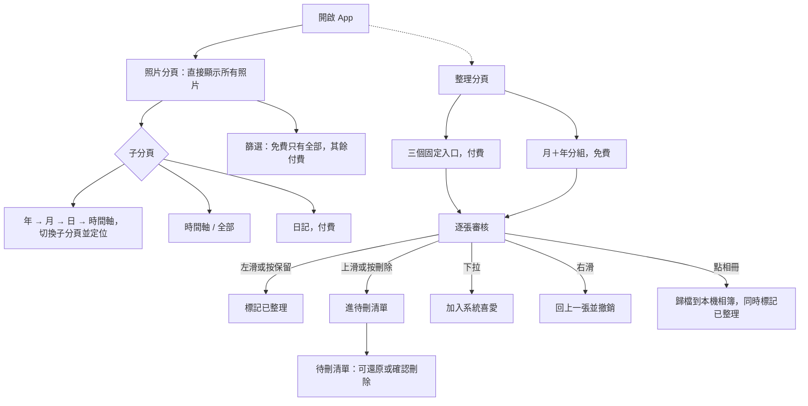

# PicDeck 產品企劃

2026-09-19（2026-09-20 更新：改為五分頁架構，首頁直接顯示所有照片，重新定義免費付費邊界與手勢）

## 已確認決策

| 項目 | 決策 |
| --- | --- |
| App 名稱 | PicDeck（中文名：相牌），App Store 查無同名撞名 |
| 語言 | 繁體中文 + 英文 |
| 平台 | iOS 優先開發，未來可能推出 Android 版 |
| 視覺風格 | 採 Apple 最新 iOS 27 設計語言；配色跟隨系統深/淺色模式，之後可開放自訂配色，目前先只做跟隨系統 |
| 品牌調性 | 簡約風格，可參考 Slidebox 的精神但不照抄，融合 iOS 27 視覺語言 |
| 定價 | 免費版依功能邊界持續可用（見下方「定價策略」）；買斷分三階段：開發贊助 NT$99 → 早鳥 NT$249 → 正式上線 NT$499 |
| 付費解鎖範圍 | 解除每日 30 張上限、開放照片分頁篩選（喜好項目/照片/影片/截圖）、標籤篩選、日記子分頁、整理分頁的三個固定入口。V2 再把「釘選紀念日到首頁儀表板」納入付費 |
| 相似/重複偵測 | 決定不做，全部功能只用 iOS 內建能力（PhotoKit 系統相簿），不開發自訂演算法 |

## 產品定位

一句話定位：**用 Slidebox 的手勢速度，做相冊助手的整理深度，配 Clutter 的低焦慮體驗。**

三款競品各自只做對了一部分：Slidebox 手勢快但功能淺、相冊助手功能深但介面複雜、Clutter 專注截圖但不處理一般照片。PicDeck 的機會是把三者的長處放進同一個核心流程，同時砍掉各自的複雜度來源。完整背景見 `docs/app-analysis/` 三份競品分析。

## 核心使用者旅程

App 開啟直接進「照片」分頁顯示所有照片，不再是來源選擇頁。底部四個分頁：照片、資料夾、整理、更多（地圖延後）。

審核畫面的手勢與按鈕並存：

| 操作 | 行為 |
| --- | --- |
| 左滑 | 保留，標記為已整理，之後不再出現在未整理清單 |
| 右滑 | 回上一張，若該張剛做過動作就一併撤銷 |
| 上滑 | 刪除，進待刪清單，確認後才真的刪 |
| 下拉 | 加入系統相簿的「喜愛」 |
| 點兩下 | 放大，單擊不觸發任何動作 |
| 幫助、保留、刪除 | 底部按鈕，與手勢等效；幫助內含使用說明與教學 |

與三款競品的差異：

| 環節 | 沿用自 | 取捨原因 |
| --- | --- | --- |
| 首頁直接顯示所有照片 | 參考相冊助手 | 開啟即可瀏覽，不用先做選擇 |
| 六個子分頁，可逐層點入 | 參考相冊助手 | 大量照片需要多層時間尺度，點年份只看該年的月 |
| 命名用「時間軸」與「全部」 | 自訂 | 取代相冊助手的「展開／緊湊」，語意更直覺 |
| 記住上次選的子分頁 | 自訂 | 使用者習慣停在特定檢視，不用每次重選 |
| 逐張手勢審核 | Slidebox | 品類標準手勢，最低學習成本 |
| 已整理狀態可持久保存 | 三者共同缺口 | 保留過的照片不再重複出現 |
| 兩階段刪除 | Slidebox | 降低誤刪恐懼 |
| 讀本機既有相簿歸檔 | Clutter | 不另建相簿，沿用使用者既有分類 |

## 功能地圖：MVP 與之後

三份競品分析都指出「功能一次做太多」是共同風險（相冊助手 12 項功能、UI 改了又改回）。MVP 只做能撐起核心旅程的功能，其餘排入之後階段。來源篩選改用 PhotoKit 系統原生分類後，不需要自建相似度或重複偵測演算法，技術風險比原先設想低不少。

| 階段 | 功能 | 來源 |
| --- | --- | --- |
| MVP | 照片分頁：子分頁為年／月／日／日記／時間軸／全部，記住上次選的項目 | 相冊助手 |
| MVP | 層級之間不推入新畫面，而是切換子分頁並捲到對應位置：點年份跳到月並定位該年、點月份跳到日並定位該月、點某天跳到時間軸並定位該天；子分頁列與底部分頁列全程保留，且可繼續上下滑動看其他區間 | 相冊助手 |
| MVP | 月檢視為月曆卡片：封面、張數、小月曆標示有照片的日期，今天標紅 | 相冊助手 |
| MVP | 日檢視為月曆格狀：週日起始，每格顯示當天第一張照片、右下角張數，今天紅框；右上角預留日記心情表情 | 相冊助手、Daylio |
| MVP | 時間軸（依日期分段，帶標題與張數）與全部（純格狀） | 相冊助手的展開／緊湊 |
| MVP | 篩選：所有項目、喜好項目、照片、影片、截圖 | 系統原生（PhotoKit） |
| MVP | 長按照片的操作選單，與整理的審核畫面一致：寫日記、標籤、喜愛、加到相冊（子選單列出本機相簿） | 自訂 |
| MVP | 自訂標籤：長按照片或在審核畫面加標籤（免費），篩選選單可依標籤篩選（付費） | Clutter |
| MVP | 標籤名稱不可重複：比對時去掉前後空白，且忽略大小寫與全形半形差異，重複時「新增」停用並顯示提示；改名同樣擋重複 | 自訂 |
| MVP | 共用的圖示選擇器（參考 Notion）：表情符號與系統圖示兩頁、關鍵字搜尋、隨機、移除、最近使用；系統圖示那頁可以挑顏色。標籤符號與日記心情都用同一個 | Notion |
| MVP | 管理相簿與標籤：同一頁兩個分頁。相簿可新增、改名、刪除（照片留在圖庫）；標籤可新增、改圖示、改名、刪除，並從這裡設紀念日 | 自訂 |
| MVP | 標籤可綁紀念日：設一個起算日，換算方式有 D-day、日數、週數、月數、年月日五種，瀏覽某一天時顯示那天過了多久，例如孩子在那天幾歲 | 紀念日類 App |
| MVP | 紀念日只在「篩選到該標籤」時顯示，位置是時間軸的日期標題與日記卡片的日期下方；沒篩選時日期標題維持原樣 | 自訂 |
| MVP | 日記卡片版面：心情圓標、日期與星期、紀念日、文字（超過五行收合並提供顯示更多）、一排四張方形照片 | Daylio |
| V2 | 首頁儀表板：把釘選的紀念日與重點資訊集中在一頁（付費）。釘選旗標已存在資料層，介面留到 V2 | 自訂 |
| MVP | 多選：全部與時間軸右上角有選擇按鈕，勾選後可批次寫日記、加標籤、加入最愛、加到相冊 | 相冊助手 |
| MVP | 批次寫日記只在勾選的照片同屬一天時出現，跨日會隱藏；批次加入最愛會跳過原本就已是最愛的照片 | 自訂 |
| MVP | 長按照片選寫日記時，該張照片預設已勾選在日記的照片區 | 自訂 |
| MVP | 日記：一天一篇，含心情表情、文字與自選照片；日檢視的格子右上角顯示當天心情 | Daylio |
| MVP | 日記分頁只列出有寫日記的日子，顯示心情、日期、文字，照片固定一排四張，超過四張時第四張標示還有幾張 | Daylio |
| MVP | 資料夾分頁：列出本機相簿 | Clutter |
| MVP | 整理分頁：三個固定入口 + 月＋年分組 | 相冊助手 |
| MVP | 逐張審核：左滑保留、右滑回上一張、上滑刪除、下拉喜愛、雙擊放大 | Slidebox |
| MVP | 幫助說明與手勢教學 | 三者共同缺口 |
| MVP | 兩階段刪除（待刪清單 → 確認 → iOS 最近刪除） | Slidebox |
| MVP | 每日 30 張額度，付費解除 | — |
| V2 | 日記子分頁（付費） | 相冊助手 |
| V2 | 地圖分頁 | 相冊助手 |
| V2 | iPad 版面 | 三者共同缺口 |
| V3 | 批次壓縮、OCR 複製截圖文字 | 相冊助手、Clutter |
| 不做 | 自建相似／重複偵測演算法、自建雲端同步 | 只用 iOS 內建能力，控制範圍 |

## 差異化亮點

對照三款競品的不足，這是 PicDeck 可以直接勝出的地方：

1. **已整理/未整理狀態可見可回頭**：Slidebox 和相冊助手的用戶都抱怨整理過的照片會跳回未分類或無法重新整理，PicDeck 從資料模型上明確區分「已處理」狀態並可隨時切回。
2. **正確處理隱藏相簿與 iCloud 同步邊界情況**：三款 App 中兩款（Slidebox、Clutter）都在這裡出過 bug，這是純工程紀律問題，先做對就是優勢。
3. **免費版不插中斷式廣告**：Slidebox 廣告中斷音樂是評分下滑主因，PicDeck 的商業模式應避開這個模式（見下方定價）。
4. **隱私標籤與文案一致**：Clutter 的「不上傳」文案與隱私標籤列出廣告用途互相矛盾，PicDeck 若聲稱純本地處理，要在隱私標籤上完全對齊。
5. **簡單清楚的免費邊界 + 分階段優惠買斷**：免費版功能界線明確（每日 30 張、來源篩選僅「全部」），不像相冊助手的 10 種內購讓人選不完，也不走 Slidebox 逐年漲價的訂閱制；開發階段買斷最低只要 NT$99，用「開發贊助」而非「早鳥」命名，明確傳達這是支持開發而非單純搶便宜。

## 定價策略

免費版可長期使用，功能邊界已定義清楚；同時開放買斷解鎖，越早購買越便宜：

| 功能 | 免費版規則 |
| --- | --- |
| 每日處理張數 | 免費版上限 30 張；付費解除上限 |
| 照片分頁瀏覽（年／月／日／時間軸／全部）與逐層點入 | 免費，無限制 |
| 照片分頁篩選 | 免費版沒有篩選，只能看全部；付費解鎖喜好項目、照片、影片、截圖 |
| 幫照片加標籤、管理標籤 | 免費，無限制 |
| 用標籤篩選 | 付費 |
| 日記子分頁 | 付費 |
| 資料夾分頁 | 免費 |
| 整理分頁的月＋年分組 | 免費 |
| 整理分頁的所有未整理／未整理的影片／未整理的截圖 | 付費 |
| 逐張審核的手勢與按鈕 | 免費，無限制 |
| 兩階段刪除 | 免費，無限制 |
| 幫助說明與手勢教學 | 免費 |

付費解鎖五件事：解除每日 30 張上限、開放照片分頁的系統分類篩選、開放標籤篩選、開放日記子分頁、開放整理分頁的三個固定入口。加標籤本身免費。

| 階段 | 名稱 | 買斷價格 |
| --- | --- | --- |
| 開發/測試階段 | 開發贊助 | NT$99 |
| 上市前推廣期 | 早鳥 | NT$249 |
| 正式上線後 | 正式售價 | NT$499 |

避開相冊助手的 10 種內購與 Slidebox 的訂閱漲價模式，採一次性買斷而非訂閱，分三階段漲價回饋越早支持的用戶。「開發贊助」刻意不叫「早鳥」，因為這個階段 App 還在開發中、功能可能不完整，用「贊助」明確傳達這筆錢是支持開發而非買一個已完成的優惠品。三個階段的切換時間點（何時從開發贊助轉早鳥、何時從早鳥轉正式售價）仍待明確定義（見待決策事項）。

若之後要做進階雲端同步等持續性服務成本的功能，需要另外評估是否要拆出獨立訂閱，不建議與一次買斷混在一起——但目前 MVP 不含雲端同步，此問題可以留到 V2 之後再決定。

## 技術面需求

- **PhotoKit**：直接讀寫系統相簿，所有刪除/歸檔/最愛動作同步回 iOS，App 本身不留實體資料副本（沿用 Slidebox 與相冊助手的作法，避免用戶資料被鎖定）。
- **已整理狀態的判定**：已整理 = 在任何系統相簿中（由 PhotoKit 推導，換機不會失效）或被標記保留。只有「保留」需要 App 自存，不另外建立相簿；每筆紀錄除了 PhotoKit 識別碼，另存拍攝時間＋像素尺寸＋媒體類型組成的指紋，換機或重裝後識別碼失效時用指紋重新綁定。紀錄放在 Documents 目錄的 JSON 檔，會被 iCloud／電腦備份帶走。多裝置同步留待之後接 CloudKit。
- **只用系統內建功能，不做自建演算法**：篩選的喜好項目、照片、影片、截圖直接對應 PhotoKit 的系統相簿（如 smartAlbumFavorites、smartAlbumVideos、smartAlbumScreenshots），「已編輯」透過 PHAsset 的調整紀錄（hasAdjustments）判斷。已決定不開發相似度或重複偵測演算法（技術上可行，主要用 Vision 框架的 `VNGenerateImageFeaturePrintRequest` 做特徵比對，但選擇不做以控制範圍），全部功能都建立在 iOS 內建能力之上，不引入自訂 ML/Vision 模型，降低開發與維護成本。
- **Vision 框架 OCR**：V2 才需要，用於截圖文字複製。
- **完全不經伺服器的隱私架構**：三款 App 中相冊助手做得最乾淨（不建任何伺服器），作為 PicDeck 的隱私基準。
- **iPad 支援**：MVP 可先只做 iPhone（降低範圍），但需在架構設計時就考慮版面適配，避免像 Clutter 一樣後補困難。
- **多語言**：繁體中文與英文雙語，UI 文字與內容需從一開始就走 `Localizable` 字串檔架構，不要硬編碼中文。
- **iOS 27 視覺風格**：採用系統原生元件（SF Symbols、Dynamic Type、系統手勢），配色使用系統語意色（semantic colors）跟隨深/淺色模式自動切換，不寫死色碼；架構上預留「自訂配色」的擴充點，但 MVP 不實作切換介面。
- **跨平台彈性（為未來 Android 鋪路）**：iOS 優先開發，但商業邏輯與資料模型（來源篩選、審核狀態、資料夾/標籤/筆記結構）應與 UI 層解耦，方便未來若要做 Android 版時重用邏輯層，UI 則另外用 Kotlin/Compose 或跨平台框架重寫，不強求現在就用跨平台技術。

## 開發路線圖

## 待決策事項

App 名稱、語言、平台、視覺風格、品牌調性、定價、買斷三階段金額（開發贊助 NT$99／早鳥 NT$249／正式 NT$499）、付費解鎖範圍、相似/重複偵測（決定不做）已確認（見上方「已確認決策」）。以下仍待決定：

- **開發贊助 → 早鳥的切換時間點**：例如以進入公開 TestFlight 測試、或某個里程碑版本為界，尚未定義。
- **早鳥 → 正式上線的切換時間點**：要以 App Store 正式上架日、還是特定版本號為界，尚未定義。
- **是否還有其他分層或加購項目**：目前只定義了單一付費解鎖（解除每日上限 + 開放來源篩選），是否需要更多分層，仍待定案。

資料來源：`docs/app-analysis/相冊助手 功能分析.md`、`docs/app-analysis/Slidebox 功能分析.md`、`docs/app-analysis/Clutter 功能分析.md`。
